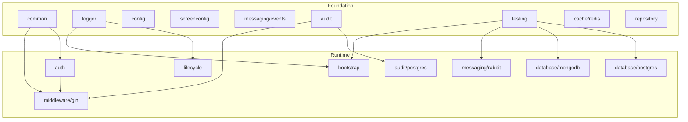

# EduGo Shared

Repositorio multi-modulo de librerias compartidas en Go. Esta documentacion fue reconstruida desde cero para reflejar el estado observable del codigo dentro de este repositorio y luego su papel dentro del ecosistema EduGo.

## Enfoque de la nueva documentacion

- `Fase 1`: documenta unicamente lo que existe dentro de `edugo-shared`.
- `Fase 2`: documenta como `edugo-shared` se integra con el ecosistema externo.
- `Fase 3`: documenta y estandariza la operacion por modulo: validacion, changelogs y releases.

## Principios editoriales

- Proceso primero, arquitectura despues.
- Cada modulo mantiene su propia `docs/`, `README.md` y `CHANGELOG.md`.
- La documentacion general enlaza a los modulos para evitar repetir detalles tecnicos.
- La fase 1 se apoya en codigo local; la fase 2 suma `ecosistema.md`, `go.work` y los servicios consumidores.

## Mapa rapido de modulos

| Modulo | Foco | README | Docs |
| --- | --- | --- | --- |
| `audit` | Contrato y composicion de eventos auditables. | [README](audit/README.md) | [Docs](audit/docs/README.md) |
| `audit/postgres` | Persistencia de auditoria en PostgreSQL mediante GORM. | [README](audit/postgres/README.md) | [Docs](audit/postgres/docs/README.md) |
| `auth` | JWT con contexto activo, passwords y refresh tokens. | [README](auth/README.md) | [Docs](auth/docs/README.md) |
| `bootstrap` | Inicializacion ordenada de recursos de infraestructura. | [README](bootstrap/README.md) | [Docs](bootstrap/docs/README.md) |
| `cache/redis` | Conexion Redis y cache JSON generico. | [README](cache/redis/README.md) | [Docs](cache/redis/docs/README.md) |
| `common` | Subpaquetes base: env, errores, validator, UUID y enums. | [README](common/README.md) | [Docs](common/docs/README.md) |
| `config` | Carga de configuracion estructurada desde archivo y entorno. | [README](config/README.md) | [Docs](config/docs/README.md) |
| `database/mongodb` | Conexion MongoDB con timeouts y pool. | [README](database/mongodb/README.md) | [Docs](database/mongodb/docs/README.md) |
| `database/postgres` | Conexion PostgreSQL, pool y transacciones. | [README](database/postgres/README.md) | [Docs](database/postgres/docs/README.md) |
| `lifecycle` | Startup ordenado y cleanup LIFO. | [README](lifecycle/README.md) | [Docs](lifecycle/docs/README.md) |
| `logger` | Interfaz de logging estructurado y backends Zap/Logrus. | [README](logger/README.md) | [Docs](logger/docs/README.md) |
| `messaging/events` | Schemas de eventos de dominio compartidos. | [README](messaging/events/README.md) | [Docs](messaging/events/docs/README.md) |
| `messaging/rabbit` | Conexion, publish, consume y DLQ para RabbitMQ. | [README](messaging/rabbit/README.md) | [Docs](messaging/rabbit/docs/README.md) |
| `middleware/gin` | Auth, permisos, contexto y auditoria para Gin. | [README](middleware/gin/README.md) | [Docs](middleware/gin/docs/README.md) |
| `repository` | Repositorios GORM para entidades de usuarios, escuelas y membresias. | [README](repository/README.md) | [Docs](repository/docs/README.md) |
| `screenconfig` | Transformaciones y validacion de configuracion dinamica de pantallas. | [README](screenconfig/README.md) | [Docs](screenconfig/docs/README.md) |
| `testing` | Testcontainers reutilizables y helpers de integracion. | [README](testing/README.md) | [Docs](testing/docs/README.md) |

## Arquitectura global actual

## Estado operativo actual

- El `Makefile` raiz orquesta los 17 modulos segun niveles de dependencia y separa el set de integracion.
- Todos los modulos con `go.mod` usan el mismo contrato operativo via `scripts/module-common.mk`.
- El inventario unico de modulos vive en `scripts/module-manifest.tsv` y alimenta `Makefile`, coverage y workflows CI/release.
- `cache/redis` y `repository` ya participan del orquestador central, coverage y release.
- El workflow `release.yml` soporta tags raiz (`vX.Y.Z`) y tags modulares (`modulo/vX.Y.Z` o `sub/modulo/vX.Y.Z`) usando el `CHANGELOG.md` correcto.
- El `go.work` del ecosistema incluye todos los modulos de `edugo-shared` para integracion local sin release.

## Navegacion recomendada

- [Indice general de documentacion](docs/README.md)
- [Fase 1](docs/phase-1/README.md)
- [Fase 2](docs/phase-2/README.md)
- [Fase 3](docs/phase-3/README.md)
- [Arquitectura del repositorio](docs/phase-1/repository-architecture.md)
- [Matriz servicio-modulo](docs/phase-2/service-module-matrix.md)
- [Flujos de integracion](docs/phase-2/integration-flows.md)
- [Roadmap de fases siguientes](docs/roadmap/README.md)
