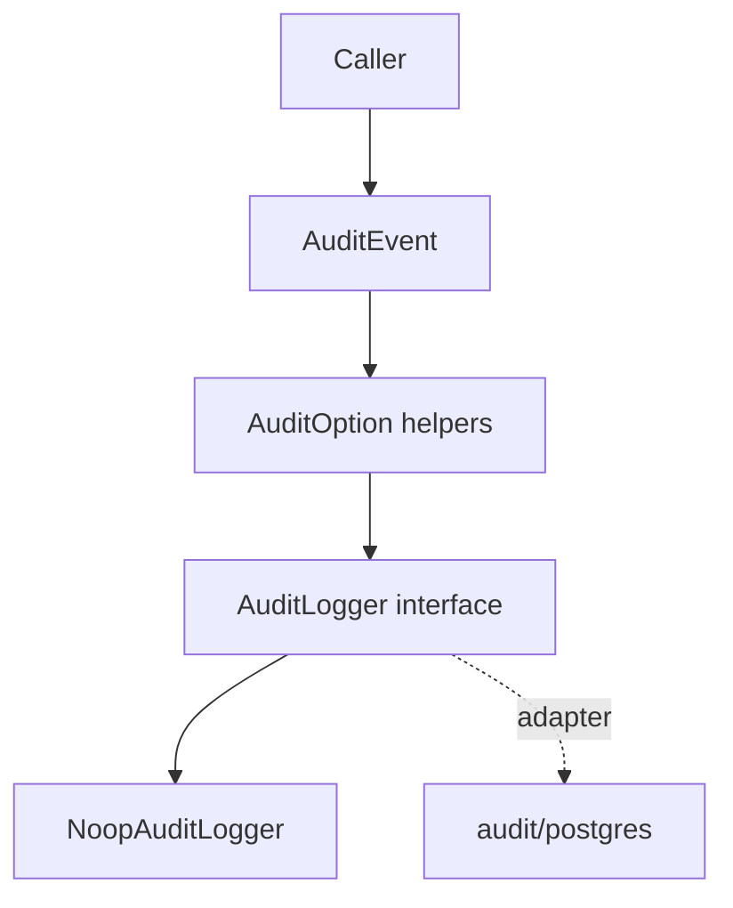

# Audit - Documentacion de fase 1

Esta documentacion cubre solo lo que existe dentro de `audit` al momento de esta fase. No intenta explicar integraciones externas ni adaptar el modulo a consumidores concretos.

## Proposito

Contrato base para construir y despachar eventos de auditoria sin acoplar el almacenamiento.

## Procesos principales

1. Construir un `AuditEvent` con datos de actor, accion, recurso, request y metadata.
2. Enriquecer el evento con `AuditOption` como severidad, categoria, cambios, permisos o error.
3. Despachar el evento a traves de la interfaz `AuditLogger` sin fijar la implementacion concreta.
4. Usar `NoopAuditLogger` cuando se requiere un sink inerte para tests o escenarios locales.

## Arquitectura local

- El modulo define el contrato `AuditLogger`, el modelo `AuditEvent` y helpers funcionales.
- No contiene persistencia propia; los adaptadores concretos viven en otros modulos.
- La API esta pensada para desacoplar a los consumidores del backend de auditoria.

## Superficie tecnica relevante

- `AuditEvent` centraliza el payload auditable.
- `AuditLogger` fija el contrato minimo `Log(ctx, event)`.
- `WithChanges`, `WithSeverity`, `WithCategory`, `WithMetadata`, `WithPermission` y `WithError` modelan enriquecimiento declarativo.
- `NewNoopAuditLogger` entrega un logger inerte para pruebas.

## Dependencias observadas

- Runtime: ninguna dependencia interna del repositorio.
- Relacion documental: la persistencia concreta queda en `audit/postgres`.

## Operacion actual

- `make build`, `make test` y `make check` cubren el ciclo local del modulo.
- `make test-all` no agrega hoy una bateria de integracion separada respecto del codigo del modulo raiz.

## Observaciones actuales

- Este modulo documenta solo el contrato y el logger noop.
- La persistencia en PostgreSQL y la extraccion desde Gin se documentan aparte.
- El modulo tiene tests unitarios propios.

## Limites de esta fase

- No describe consumidores externos ni politicas de retencion de auditoria.
- No documenta aun integraciones con el archivo externo `ecosistema.md`.
- No redefine politicas de release por modulo; eso queda para la fase 3.
