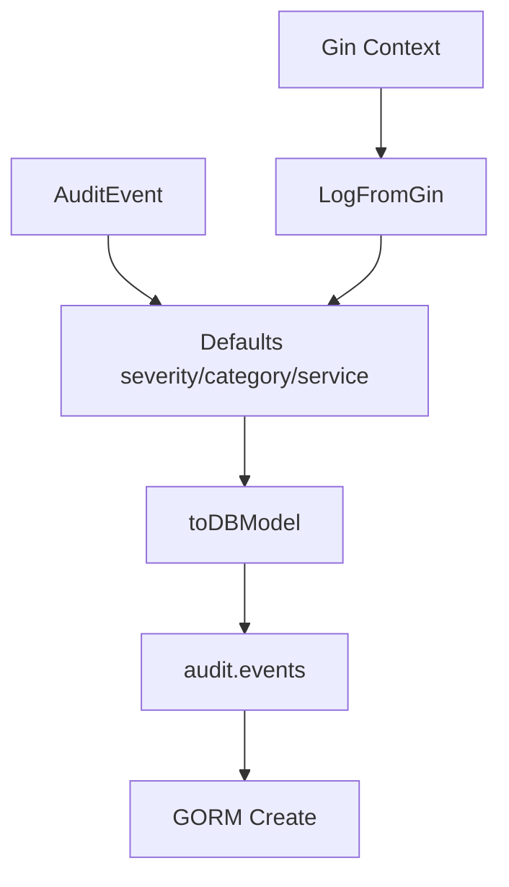

# Audit PostgreSQL - Documentacion de fase 1

Esta documentacion cubre solo lo que existe dentro de `audit/postgres` al momento de esta fase. No intenta explicar integraciones externas ni adaptar el modulo a consumidores concretos.

## Proposito

Adaptador de auditoria que normaliza eventos y los persiste en `audit.events` usando GORM.

## Procesos principales

1. Recibir un `audit.AuditEvent` o extraerlo desde `gin.Context` por conveniencia.
2. Completar defaults de severidad, categoria y `serviceName` si el llamador no los define.
3. Transformar el evento al modelo `auditEventDB` con campos opcionales y JSON serializado.
4. Persistir el registro en la tabla `audit.events` con el contexto de la request.

## Arquitectura local

- La implementacion concreta es `PostgresAuditLogger` y depende del contrato del modulo `audit`.
- El metodo `LogFromGin` es una capa de conveniencia para entornos HTTP con Gin.
- La tabla objetivo esperada es `audit.events`; la migracion no vive en este modulo.

## Superficie tecnica relevante

- `NewPostgresAuditLogger(db, serviceName)` crea el adaptador.
- `Log(ctx, event)` persiste un `audit.AuditEvent` normalizado.
- `LogFromGin(c, action, resourceType, resourceID, opts...)` compone el evento desde una request Gin.

## Dependencias observadas

- Runtime interno: `audit`.
- Runtime externo: `gorm.io/gorm` y `github.com/gin-gonic/gin`.

## Operacion actual

- `make build`, `make test` y `make check` existen localmente como contrato operativo del modulo.
- La ejecucion actual no tiene tests dedicados en `audit/postgres`; la validacion efectiva depende de compilacion y consumidores.

## Observaciones actuales

- Es un adaptador especifico de almacenamiento, no el contrato general de auditoria.
- Asume que la tabla `audit.events` y sus serializers existen del lado de la base de datos.
- No se encontraron archivos `_test.go` propios en este modulo durante esta fase.

## Limites de esta fase

- La creacion de esquema SQL y la integracion con servicios consumidores quedan para la fase 2.
- No documenta aun integraciones con el archivo externo `ecosistema.md`.
- No redefine politicas de release por modulo; eso queda para la fase 3.
