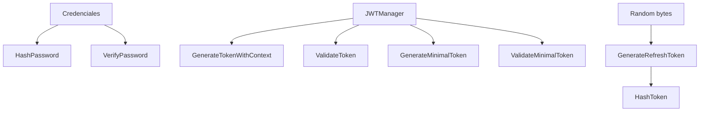

# Auth - Documentacion de fase 1

Esta documentacion cubre solo lo que existe dentro de `auth` al momento de esta fase. No intenta explicar integraciones externas ni adaptar el modulo a consumidores concretos.

## Proposito

Servicios compartidos de autenticacion: hashing de password, JWT de acceso y refresh tokens.

## Procesos principales

1. Hashear passwords con bcrypt costo 12 y verificar hashes en login.
2. Generar access tokens con `JWTManager` y un `UserContext` activo con rol y permisos.
3. Validar access tokens exigiendo issuer valido y `ActiveContext` presente.
4. Generar minimal tokens para refresh y distinguirlos por `TokenUse=refresh`.
5. Generar refresh tokens aleatorios y almacenar solo su hash SHA-256.

## Arquitectura local

- El centro del modulo es `JWTManager`, que encapsula issuer y secret.
- Los claims propios se concentran en `Claims` y embeben `jwt.RegisteredClaims`.
- La parte de refresh tokens convive con JWT, pero usa un flujo separado y storage hash-only.

## Superficie tecnica relevante

- `JWTManager` expone generacion y validacion de tokens.
- `Claims` y `UserContext` modelan el contexto RBAC embebido en JWT.
- `HashPassword` y `VerifyPassword` resuelven el flujo de password.
- `GenerateRefreshToken` y `HashToken` soportan almacenamiento seguro de refresh tokens.

## Dependencias observadas

- Runtime interno: `common/errors`.
- Runtime externo: `github.com/golang-jwt/jwt/v5`, `github.com/google/uuid`, `golang.org/x/crypto/bcrypt`.

## Operacion actual

- `make build`, `make test`, `make test-race` y `make check` cubren el modulo.
- El modulo ya tiene benchmarks y tests concurrentes que ejercitan los caminos criticos.

## Observaciones actuales

- Los access tokens requieren `ActiveContext`; los refresh usan un camino minimal separado.
- El limite de password es 72 bytes por la restriccion propia de bcrypt.
- El modulo tiene una bateria amplia de tests unitarios y benchmarks.

## Limites de esta fase

- No documenta aun como otros servicios resuelven refresh persistence o revocacion.
- No documenta aun integraciones con el archivo externo `ecosistema.md`.
- No redefine politicas de release por modulo; eso queda para la fase 3.
