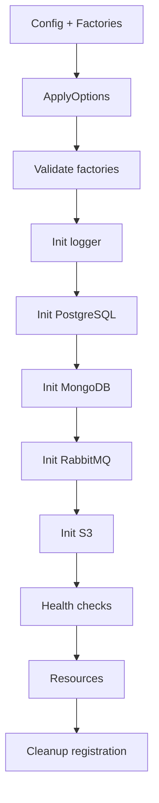

# Bootstrap - Documentacion de fase 1

Esta documentacion cubre solo lo que existe dentro de `bootstrap` al momento de esta fase. No intenta explicar integraciones externas ni adaptar el modulo a consumidores concretos.

## Proposito

Orquestador de inicializacion para logger, bases de datos, mensajeria y S3 mediante factories.

## Procesos principales

1. Aplicar opciones de bootstrap y mezclar factories reales con mocks si corresponde.
2. Validar que existan factories para los recursos marcados como requeridos.
3. Inicializar primero el logger y luego PostgreSQL, MongoDB, RabbitMQ y S3.
4. Registrar recursos inicializados dentro de `Resources` y sus cleanups asociados.
5. Ejecutar health checks finales salvo que `SkipHealthCheck` este activo.

## Arquitectura local

- `Bootstrap` trabaja sobre interfaces de factory para desacoplar el origen real de los recursos.
- `Resources` es el contenedor de salida para logger, conexiones y clientes compartidos.
- La funcion acepta `config interface{}` para poder extraer configuracion sin amarrarse al modulo `config`.

## Superficie tecnica relevante

- `Bootstrap` es el punto de entrada principal.
- `Factories` agrupa los contratos `LoggerFactory`, `PostgreSQLFactory`, `MongoDBFactory`, `RabbitMQFactory` y `S3Factory`.
- `Resources` expone `HasLogger`, `HasPostgreSQL`, `HasMongoDB`, `HasMessagePublisher` y `HasStorageClient`.
- `BootstrapOptions` y helpers `WithRequiredResources`, `WithOptionalResources`, `WithSkipHealthCheck`, `WithMockFactories` y `WithStopOnFirstError` controlan la orquestacion.

## Dependencias observadas

- Runtime interno: `logger`.
- Tests internos: `testing` para integracion con containers.
- Runtime externo: AWS S3 SDK, MongoDB driver, GORM y AMQP.

## Operacion actual

- `make build`, `make test`, `make test-race` y `make check` validan el modulo.
- `make test-all` ejecuta la bateria completa, incluyendo pruebas que requieren Docker y servicios reales.

## Observaciones actuales

- Es el modulo de mayor acoplamiento tecnico porque coordina recursos heterogeneos.
- El orden real observado es logger primero, luego bases de datos, mensajeria y finalmente storage.
- Tiene tests unitarios e integraciones para PostgreSQL, MongoDB, RabbitMQ y S3.

## Limites de esta fase

- La integracion con servicios del ecosistema y configuraciones concretas queda fuera de esta fase.
- No documenta aun integraciones con el archivo externo `ecosistema.md`.
- No redefine politicas de release por modulo; eso queda para la fase 3.
