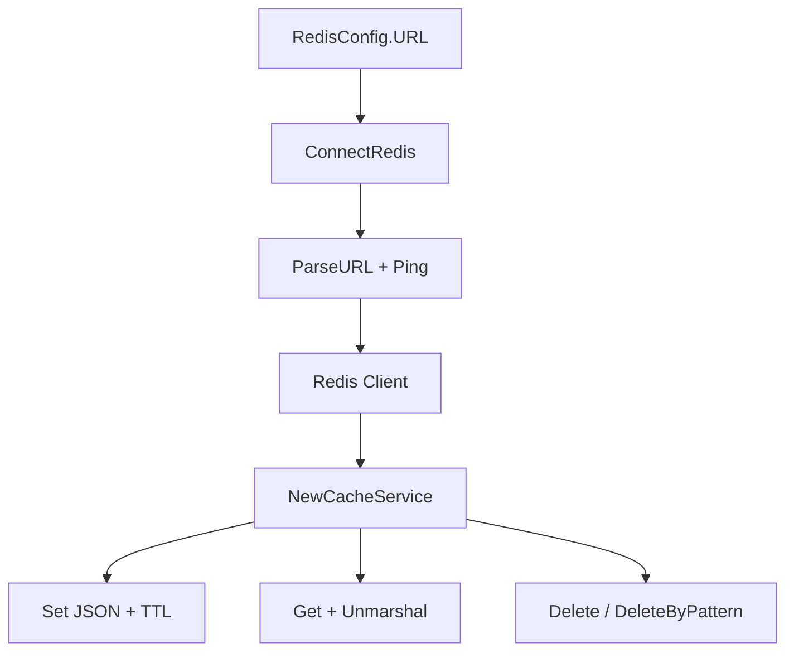

# Cache Redis - Documentacion de fase 1

Esta documentacion cubre solo lo que existe dentro de `cache/redis` al momento de esta fase. No intenta explicar integraciones externas ni adaptar el modulo a consumidores concretos.

## Proposito

Modulo pequeño para conectar a Redis por URL y exponer una cache JSON con TTL y borrado por patron.

## Procesos principales

1. Parsear una URL Redis o Rediss y validar conectividad con `PING`.
2. Crear un `CacheService` backed por `go-redis`.
3. Serializar payloads a JSON para `Set` con TTL.
4. Deserializar JSON en `Get` y borrar entradas por clave o por patron usando `SCAN`.

## Arquitectura local

- La implementacion publica es una interfaz minima `CacheService` con un backend privado `redisCacheService`.
- La conexion se concentra en `ConnectRedis`, separada de la logica de cache.
- No incorpora namespacing ni invalidacion avanzada mas alla de `DeleteByPattern`.

## Superficie tecnica relevante

- `RedisConfig` modela la URL de conexion.
- `ConnectRedis` retorna un `*redis.Client` ya validado.
- `NewCacheService` expone `Get`, `Set`, `Delete` y `DeleteByPattern`.

## Dependencias observadas

- Runtime interno: ninguna dependencia interna del repositorio.
- Runtime externo: `github.com/redis/go-redis/v9`.

## Operacion actual

- `make build`, `make test` y `make check` existen en el modulo.
- El modulo tiene Makefile propio, pero hoy no aparece en el `Makefile` raiz ni en las matrices CI/release del repositorio.

## Observaciones actuales

- El alcance actual es deliberadamente pequeno: conexion, JSON y borrado basico.
- No se observaron adapters de metrics, locking o cache warming.
- El modulo tiene tests unitarios propios.

## Limites de esta fase

- La integracion con consumidores y politicas globales de cache queda para fases posteriores.
- No documenta aun integraciones con el archivo externo `ecosistema.md`.
- No redefine politicas de release por modulo; eso queda para la fase 3.
