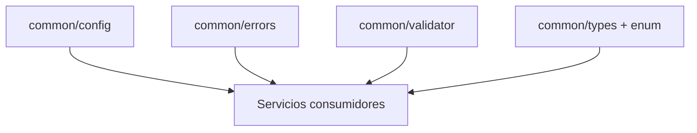

# Common - Documentacion de fase 1

Esta documentacion cubre solo lo que existe dentro de `common` al momento de esta fase. No intenta explicar integraciones externas ni adaptar el modulo a consumidores concretos.

## Proposito

Modulo base del repositorio: centraliza primitives reutilizables y subpaquetes de bajo acoplamiento.

## Procesos principales

1. Resolver variables de entorno y detectar ambiente con `common/config`.
2. Construir `AppError` tipados y mapearlos a status HTTP en `common/errors`.
3. Acumular errores de validacion y helpers de formato en `common/validator`.
4. Generar, parsear y serializar UUIDs en `common/types`.
5. Definir enums de permisos, roles, estados y tipos de evento en `common/types/enum`.

## Arquitectura local

- No es un unico package funcional; el consumo real ocurre por subpaquetes.
- El modulo prioriza dependencias minimas para ser la base de otras librerias.
- Los enums del dominio viven junto a tipos genericos para evitar duplicacion transversal.

## Superficie tecnica relevante

- `common/config` expone `GetEnv`, `GetEnvInt`, `GetEnvironment` y helpers afines.
- `common/errors` define `AppError`, constructores tipados y mapeo de status HTTP.
- `common/validator` aporta validaciones comunes y agregacion de errores.
- `common/types` aporta `UUID` y `common/types/enum` encapsula enums de dominio.

## Dependencias observadas

- Runtime interno: modulo base, sin dependencias a otros modulos del repositorio.
- Runtime externo: `github.com/google/uuid` y dependencias ligeras de soporte.

## Operacion actual

- `make build`, `make test`, `make test-race` y `make check` validan el modulo.
- La cobertura actual se reparte entre varios subpaquetes pequenos y estables.

## Observaciones actuales

- Consumir `common` implica importar subpaquetes concretos; no existe un package raiz unico para toda la API.
- Aqui estan varios contratos que otros modulos consideran fundacionales.
- Los tests cubren errores, validator, UUID y enums.

## Limites de esta fase

- Esta fase no define una taxonomia compartida con otros repositorios fuera de `edugo-shared`.
- No documenta aun integraciones con el archivo externo `ecosistema.md`.
- No redefine politicas de release por modulo; eso queda para la fase 3.
