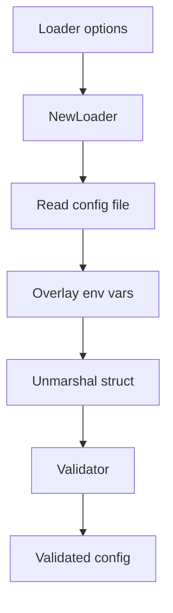

# Config - Documentacion de fase 1

Esta documentacion cubre solo lo que existe dentro de `config` al momento de esta fase. No intenta explicar integraciones externas ni adaptar el modulo a consumidores concretos.

## Proposito

Carga configuracion YAML con Viper, la mezcla con variables de entorno y la valida con tags struct.

## Procesos principales

1. Construir un `Loader` con path, nombre, tipo de archivo y prefijo de entorno.
2. Leer un archivo de configuracion si existe y tolerar ausencia del archivo en `Load`.
3. Aplicar override de variables de entorno mediante `AutomaticEnv` y `SetEnvKeyReplacer`.
4. Unmarshal la configuracion en structs como `BaseConfig`.
5. Validar el struct con tags usando `Validator` y emitir `ValidationError` estructurado.

## Arquitectura local

- El flujo se divide en dos piezas: `Loader` para carga y `Validator` para reglas de estructura.
- `BaseConfig` concentra configuracion comun de servidor, logger, PostgreSQL, MongoDB y bootstrap.
- El modulo no resuelve secretos ni providers externos; solo carga y valida datos.

## Superficie tecnica relevante

- `Loader` y `LoaderOption` modelan la carga configurable.
- `BaseConfig`, `DatabaseConfig`, `MongoDBConfig`, `LoggerConfig` y `BootstrapConfig` sirven como estructura base.
- `Validator` y `ValidationError` concentran la capa de validacion.

## Dependencias observadas

- Runtime interno: sin dependencias internas del repositorio.
- Runtime externo: `github.com/spf13/viper` y `github.com/go-playground/validator/v10`.

## Operacion actual

- `make build`, `make test`, `make test-race` y `make check` cubren el modulo.
- No se observaron tests de integracion externos; el enfoque actual es unitario.

## Observaciones actuales

- El loader tolera la ausencia del archivo en `Load`, pero `LoadFromFile` exige que exista.
- El modulo documenta un shape de configuracion base, no una configuracion universal obligatoria para todos los servicios.
- Tiene tests unitarios sobre carga y validacion.

## Limites de esta fase

- La correspondencia con configuraciones reales del ecosistema se documentara en la fase 2.
- No documenta aun integraciones con el archivo externo `ecosistema.md`.
- No redefine politicas de release por modulo; eso queda para la fase 3.
