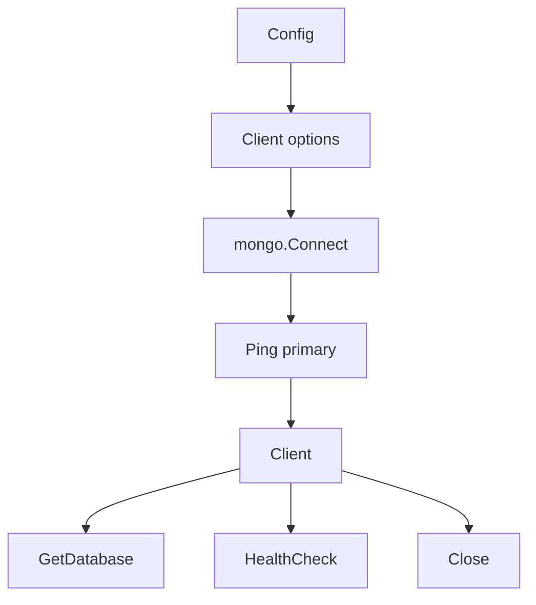

# Database MongoDB - Documentacion de fase 1

Esta documentacion cubre solo lo que existe dentro de `database/mongodb` al momento de esta fase. No intenta explicar integraciones externas ni adaptar el modulo a consumidores concretos.

## Proposito

Modulo de bajo nivel para abrir, validar y cerrar conexiones MongoDB.

## Procesos principales

1. Construir `Config` con defaults de URI, database, timeout y tamanos de pool.
2. Configurar `ClientOptions` con URI, pool y timeouts.
3. Conectar el cliente y validar conectividad contra `readpref.Primary()`.
4. Exponer acceso a una database concreta con `GetDatabase`.
5. Ejecutar health checks y cierre controlado del cliente.

## Arquitectura local

- La API publica es funcional y pequena: `DefaultConfig`, `Connect`, `GetDatabase`, `HealthCheck` y `Close`.
- No incorpora repositorios ni abstracciones de coleccion; solo conecta y vigila la salud de la conexion.
- La validacion de integracion real se apoya en el modulo `testing` durante las pruebas.

## Superficie tecnica relevante

- `Config` modela URI, database, timeout y pool.
- `DefaultConfig` entrega un baseline local.
- `Connect`, `GetDatabase`, `HealthCheck` y `Close` cubren el ciclo de vida completo.

## Dependencias observadas

- Runtime interno: ninguna dependencia interna en produccion.
- Tests internos: `testing` para integracion con containers.
- Runtime externo: MongoDB Go Driver v2.

## Operacion actual

- `make build`, `make test`, `make test-race` y `make check` cubren el modulo.
- `make test-all` ejecuta pruebas con Docker/Testcontainers para validar conexion real.

## Observaciones actuales

- El modulo trabaja a nivel de cliente y database, no de repositorios o DAOs.
- La validacion de salud usa `Ping` al primary.
- Existe cobertura combinada de tests unitarios e integracion.

## Limites de esta fase

- La forma en que otros modulos o servicios modelan colecciones queda fuera de esta fase.
- No documenta aun integraciones con el archivo externo `ecosistema.md`.
- No redefine politicas de release por modulo; eso queda para la fase 3.
