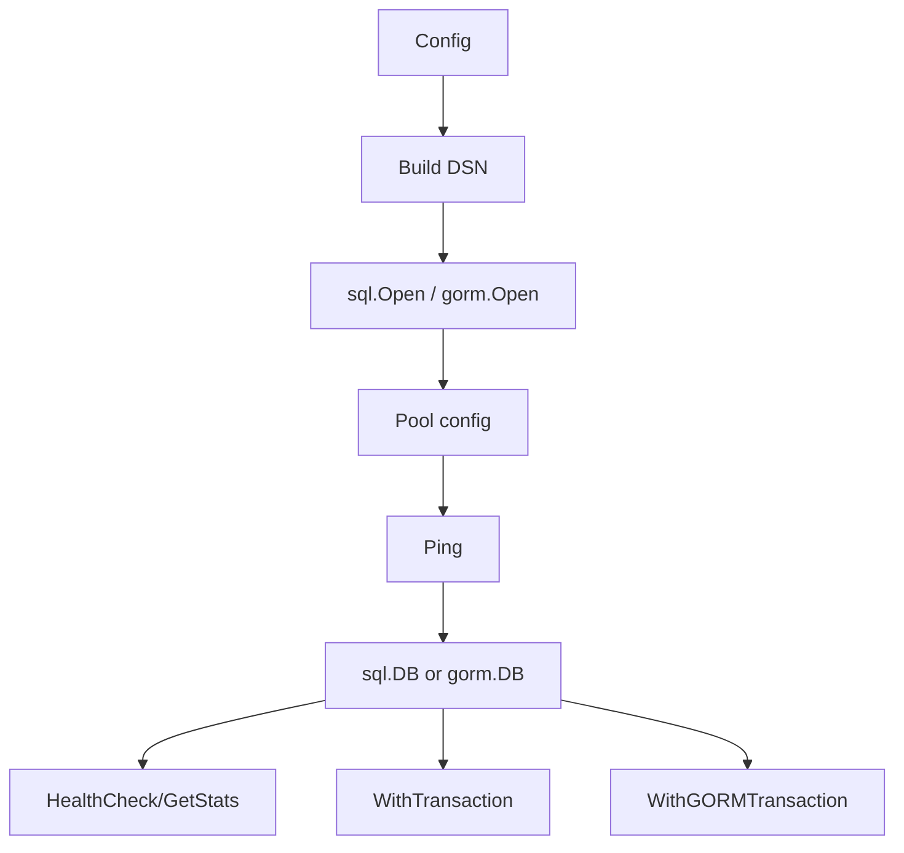

# Database PostgreSQL - Documentacion de fase 1

Esta documentacion cubre solo lo que existe dentro de `database/postgres` al momento de esta fase. No intenta explicar integraciones externas ni adaptar el modulo a consumidores concretos.

## Proposito

Capa de bajo nivel para sql.DB, GORM y wrappers de transaccion sobre PostgreSQL.

## Procesos principales

1. Construir `Config` y un DSN con `search_path`, SSL y timeout.
2. Abrir `sql.DB`, configurar pool y verificar conectividad con `PingContext`.
3. Crear una conexion GORM equivalente con `ConnectGORM`.
4. Ejecutar health checks, cierre y lectura de stats del pool.
5. Encapsular transacciones SQL y GORM con rollback ante error o panic.

## Arquitectura local

- La API separa conexion nativa (`Connect`) y conexion GORM (`ConnectGORM`).
- Los wrappers `WithTransaction`, `WithTransactionIsolation` y `WithGORMTransaction` encapsulan la semantica transaccional.
- El modulo no define repositorios ni entidades; esos consumers viven fuera.

## Superficie tecnica relevante

- `Config` y `DefaultConfig` definen el baseline de conexion.
- `Connect`, `ConnectGORM`, `HealthCheck`, `GetStats` y `Close` cubren conectividad.
- `WithTransaction`, `WithTransactionIsolation` y `WithGORMTransaction` encapsulan el control transaccional.

## Dependencias observadas

- Runtime interno: ninguna dependencia interna en produccion.
- Tests internos: `testing` para integracion con PostgreSQL real.
- Runtime externo: `database/sql`, `github.com/lib/pq`, GORM y driver postgres de GORM.

## Operacion actual

- `make build`, `make test`, `make test-race` y `make check` cubren el modulo.
- `make test-all` ejecuta integracion con Docker; existe ademas `TESTING.md` historico del modulo.

## Observaciones actuales

- El modulo ya documentaba testing de integracion, pero la nueva documentacion lo reubica dentro del esquema por fases.
- La API se mantiene en nivel de infraestructura y transacciones.
- Tiene tests unitarios e integracion con buena densidad sobre conexion y transacciones.

## Limites de esta fase

- La relacion con repositorios y esquemas concretos del ecosistema se pospone a la fase 2.
- No documenta aun integraciones con el archivo externo `ecosistema.md`.
- No redefine politicas de release por modulo; eso queda para la fase 3.
