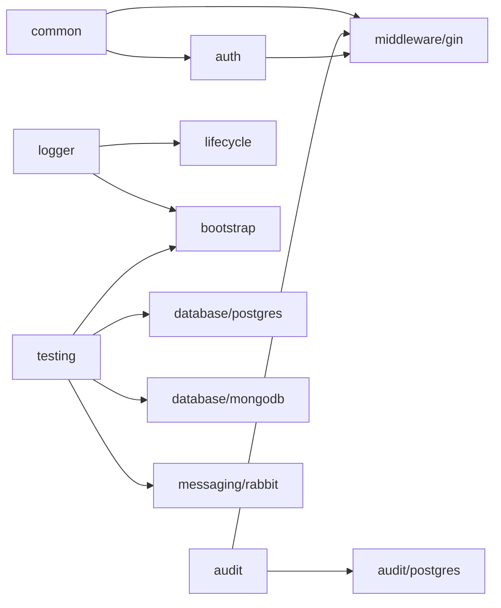

# Arquitectura del repositorio

## Decisiones estructurales observadas

- El repositorio esta organizado como una coleccion de modulos Go independientes, cada uno con `go.mod` propio.
- La raiz funciona como orquestador operacional (`Makefile`, workflows y versionado global), no como modulo Go unico.
- Los directorios anidados (`audit/postgres`, `database/postgres`, `database/mongodb`, `messaging/events`, `messaging/rabbit`, `middleware/gin`, `cache/redis`) representan especializaciones tecnicas bajo dominios compartidos.
- La dependencia interna entre modulos es baja y se concentra en pocos ejes: `common`, `logger`, `audit`, `auth` y `testing`.

## Vista de dependencias internas

## Familias modulares

- Fundacionales: `common`, `config`, `logger`.
- Seguridad y request pipeline: `auth`, `audit`, `audit/postgres`, `middleware/gin`.
- Datos e infraestructura: `database/postgres`, `database/mongodb`, `cache/redis`, `repository`, `bootstrap`, `lifecycle`.
- Mensajeria: `messaging/events`, `messaging/rabbit`.
- Configuracion dinamica de UI: `screenconfig`.
- Testing de integracion: `testing`.

## Hallazgos operativos

- El `Makefile` raiz define niveles de dependencia y orquesta build/test/lint/vet para los 17 modulos del repositorio.
- Las matrices CI, coverage y release consumen el mismo inventario modular mediante `scripts/module-manifest.tsv`.
- `cache/redis` y `repository` ya quedaron integrados al orquestador central.
- El release ahora soporta tags globales y tags por modulo segun el `CHANGELOG.md` correspondiente.
