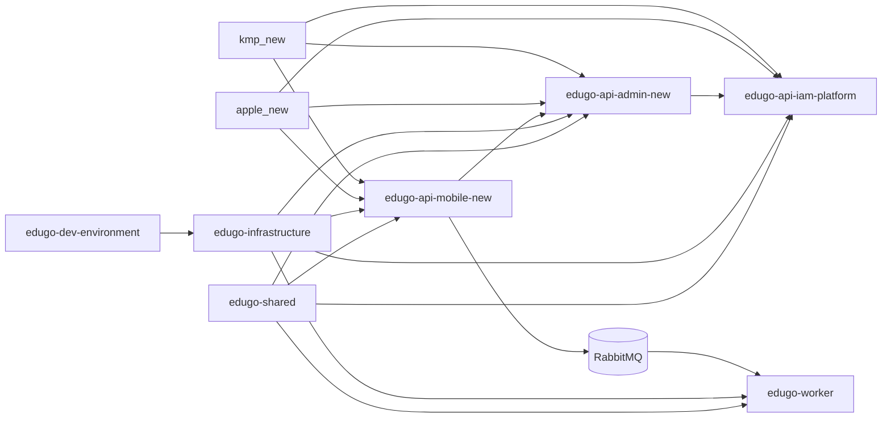

# Overview del ecosistema

## Posicion de `edugo-shared`

`edugo-shared` es la libreria Go compartida del backend EduGo. No es un servicio ejecutable; su funcion es suministrar capacidades comunes a APIs y workers.

## Servicios del ecosistema que interactuan con `edugo-shared`

| Componente | Tipo | Relacion con `edugo-shared` | Evidencia principal |
| --- | --- | --- | --- |
| `edugo-api-iam-platform` | API REST | Consume modulos de auth, auditoria, logging, middleware y repository | `go.mod` + `cmd/main.go` + `internal/container/container.go` |
| `edugo-api-admin-new` | API REST | Consume auth, auditoria, logging, middleware y repository; delega auth a IAM | `go.mod` + `cmd/main.go` + `internal/container/container.go` |
| `edugo-api-mobile-new` | API REST | Consume auth, auditoria, cache Redis, logging, mensajeria Rabbit y repository | `go.mod` + `internal/container/container.go` |
| `edugo-worker` | Worker asincrono | Consume bootstrap, common, database/postgres, lifecycle, logger y testing | `go.mod` + `internal/bootstrap/resource_builder.go` |
| `edugo-infrastructure` | Libreria Go | No consume `edugo-shared`; actua como fuente de verdad de entidades, migraciones y schemas | `ecosistema.md` + `go.mod` |
| `edugo-dev-environment` | Herramientas dev | No consume `edugo-shared` directamente; ejecuta migraciones desde `edugo-infrastructure` | `ecosistema.md` + `go.mod` |
| `kmp_new` | Frontend KMP | No importa `edugo-shared` de forma directa; lo consume indirectamente via APIs | `ecosistema.md` |
| `apple_new` | Frontend SwiftUI | No importa `edugo-shared` de forma directa; lo consume indirectamente via APIs | `ecosistema.md` |

## Topologia externa relevante

## Fronteras importantes

### `edugo-shared` vs `edugo-infrastructure`

- `edugo-shared` define utilidades, contratos de runtime, conectividad y patrones compartidos.
- `edugo-infrastructure` define entidades GORM, migraciones SQL, seeds y colecciones MongoDB.
- El modulo [`repository`](../../repository/docs/README.md) es el punto donde `edugo-shared` se acopla de forma explicita con `edugo-infrastructure/postgres`.

### `edugo-shared` vs `edugo-dev-environment`

- `edugo-shared` no levanta infraestructura local por si mismo.
- `edugo-dev-environment` es quien crea el entorno Docker y ejecuta migraciones.
- La regla de `ecosistema.md` es clara: cambios estructurales de BD se hacen en `edugo-infrastructure` y se materializan via `edugo-dev-environment`.

### `edugo-shared` vs frontends

- Ni `kmp_new` ni `apple_new` consumen `edugo-shared` de forma directa.
- El valor de `edugo-shared` llega al frontend a traves del comportamiento de IAM, Admin y Mobile API.

## Workspace local

El archivo `go.work` incluye los modulos de `edugo-shared` y los servicios vecinos. Eso significa que en desarrollo local el ecosistema entero puede probar integraciones reales sin publicar releases.

## Implicacion operativa

`ecosistema.md` marca una distincion fuerte entre desarrollo local y distribucion:

1. En local, `go.work` resuelve todo.
2. Para compartir cambios entre repos remotos, `edugo-shared` debe publicarse via GitHub Release.
