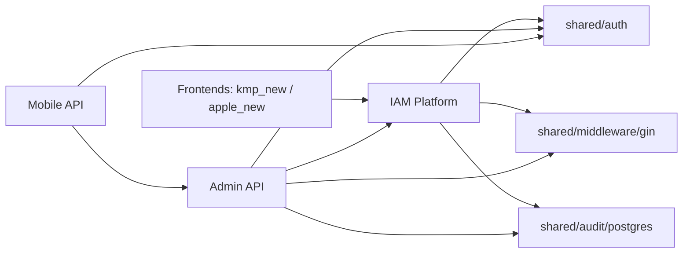
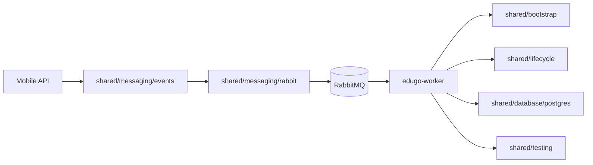

# Flujos de integracion

## 1. Autenticacion y autorizacion entre frontends y APIs

### Lectura

1. Los frontends hablan con IAM, Admin y Mobile API.
2. IAM resuelve autenticacion primaria y emite/valida JWT.
3. Admin y Mobile no usan `JWTAuthMiddleware` directo para auth remota; usan clientes propios y luego inyectan `auth.Claims` en Gin para reutilizar el middleware compartido de permisos.
4. IAM, Admin y Mobile registran auditoria persistida en PostgreSQL mediante `audit/postgres`.

## 2. Flujo administrativo

1. `edugo-api-admin-new` valida el token con un `AuthClient` propio que puede apoyarse en IAM.
2. El contexto resultante se escribe en Gin con estructura compatible con `shared/middleware/gin`.
3. Los handlers administrativos consumen repositorios compartidos de users, memberships y schools desde `shared/repository`.
4. La auditoria de mutaciones usa `AuditMiddleware` + `audit/postgres`.

## 3. Flujo de contenido y evaluaciones en Mobile API

1. `edugo-api-mobile-new` arranca PostgreSQL, MongoDB, RabbitMQ, S3 y Redis desde su propio contenedor de dependencias.
2. Usa `cache/redis` para construir un `CacheService` cuando Redis esta disponible.
3. Usa `messaging/rabbit` para crear un publisher y `messaging/events` para los contratos de eventos.
4. Usa `repository` y repos locales para persistencia relacional; MongoDB queda en repos locales del servicio.
5. La autenticacion se valida contra Admin API via un `AuthClient` propio, no con JWT local puro como IAM.

## 4. Flujo asincrono de procesamiento

### Lectura

1. Mobile API es el punto del ecosistema donde el uso de mensajeria compartida aparece de forma directa.
2. El worker consume esos eventos y enruta el procesamiento a su `ProcessorRegistry` local.
3. El worker usa `bootstrap` y `lifecycle` como base de infraestructura, en lugar de depender del stack HTTP compartido.
4. Para integracion, el worker reusa `shared/testing/containers`.

## 5. Flujo de datos y limites con infraestructura

1. `edugo-infrastructure` define entidades, migraciones y seeds.
2. `shared/repository` se apoya directamente en `edugo-infrastructure/postgres/entities`.
3. Los servicios consumen esas entidades y repositorios como capa de persistencia comun.
4. `edugo-dev-environment` materializa los cambios sobre el entorno local y ejecuta migraciones.

## 6. Flujo de versionado y desarrollo local

### Desarrollo local

- `go.work` incluye APIs, worker, `edugo-shared` e `edugo-infrastructure`.
- Los cambios se integran localmente sin necesidad de release inmediato.

### Integracion remota

- `ecosistema.md` establece que los cambios en `edugo-shared` requieren GitHub Release.
- Luego cada API actualiza la dependencia con `go get github.com/EduGoGroup/edugo-shared/[modulo]@vX.Y.Z`.
- Esto refuerza la necesidad de la fase 3: validar y publicar por modulo de forma consistente.
