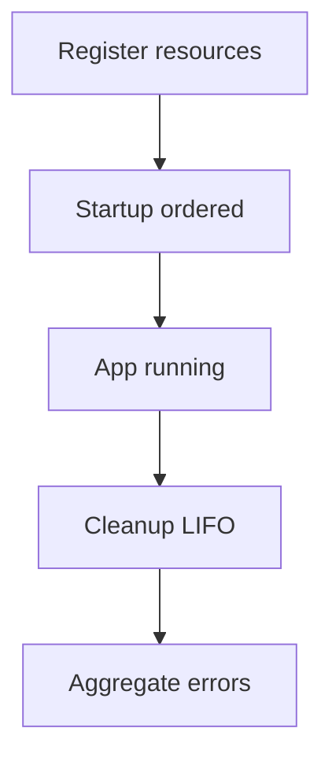

# Lifecycle - Documentacion de fase 1

Esta documentacion cubre solo lo que existe dentro de `lifecycle` al momento de esta fase. No intenta explicar integraciones externas ni adaptar el modulo a consumidores concretos.

## Proposito

Manager de ciclo de vida para recursos de infraestructura con startup secuencial y cleanup LIFO.

## Procesos principales

1. Registrar recursos con nombre, startup opcional y cleanup.
2. Ejecutar la fase de startup en orden de registro.
3. Detener el proceso si un startup falla y reportar el recurso causante.
4. Ejecutar cleanups en orden inverso acumulando errores sin abortar la limpieza total.

## Arquitectura local

- `Manager` conserva una lista protegida por mutex de `Resource`.
- El logger es opcional y solo agrega trazabilidad, no cambia la logica.
- El cleanup agrega errores y mantiene la semantica LIFO como contrato principal.

## Superficie tecnica relevante

- `NewManager` crea el manager.
- `Register` y `RegisterSimple` agregan recursos.
- `Startup`, `Cleanup`, `Count` y `Clear` cubren el ciclo completo.

## Dependencias observadas

- Runtime interno: `logger`.
- No depende de ningun driver o framework concreto.

## Operacion actual

- `make build`, `make test`, `make test-race` y `make check` validan el modulo.
- La suite actual es enteramente unitaria.

## Observaciones actuales

- El modulo es pequeno y estable, orientado a coordinacion in-process.
- Su valor principal es el orden de cleanup y el agregado de errores.
- Tiene tests unitarios sobre startup, cleanup y LIFO.

## Limites de esta fase

- No documenta aun como cada aplicacion del ecosistema registra sus recursos concretos.
- No documenta aun integraciones con el archivo externo `ecosistema.md`.
- No redefine politicas de release por modulo; eso queda para la fase 3.
