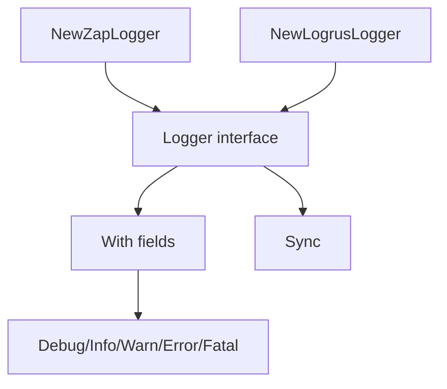

# Logger - Documentacion de fase 1

Esta documentacion cubre solo lo que existe dentro de `logger` al momento de esta fase. No intenta explicar integraciones externas ni adaptar el modulo a consumidores concretos.

## Proposito

Abstraccion de logging estructurado con implementaciones en Zap y Logrus.

## Procesos principales

1. Construir un logger Zap con nivel y formato configurables.
2. Adaptar una instancia Logrus a la interfaz comun del repositorio.
3. Agregar contexto con `With(fields...)` y reutilizarlo aguas abajo.
4. Emitir logs estructurados y sincronizar buffers cuando el backend lo necesita.

## Arquitectura local

- La interfaz `Logger` define la superficie comun para los consumidores.
- Zap y Logrus son implementaciones intercambiables segun el runtime.
- El contrato usa key/value variadico para minimizar acoplamiento entre backends.

## Superficie tecnica relevante

- `Logger` define `Debug`, `Info`, `Warn`, `Error`, `Fatal`, `With` y `Sync`.
- `NewZapLogger(level, format)` crea un backend Zap.
- `NewLogrusLogger(logrusLogger)` adapta una instancia Logrus.

## Dependencias observadas

- Runtime interno: ninguna dependencia interna.
- Runtime externo: `go.uber.org/zap` y `github.com/sirupsen/logrus`.

## Operacion actual

- `make build`, `make test`, `make test-race` y `make check` cubren el modulo.
- La suite actual es unitaria y prueba ambos backends.

## Observaciones actuales

- El modulo no define politicas de logging; solo la abstraccion y sus implementaciones.
- Zap soporta formato `json` o `console`; Logrus se adapta a la interfaz comun.
- Tiene tests unitarios sobre niveles, campos y formatos.

## Limites de esta fase

- La unificacion con observabilidad o trazas externas quedara para una fase de integracion.
- No documenta aun integraciones con el archivo externo `ecosistema.md`.
- No redefine politicas de release por modulo; eso queda para la fase 3.
