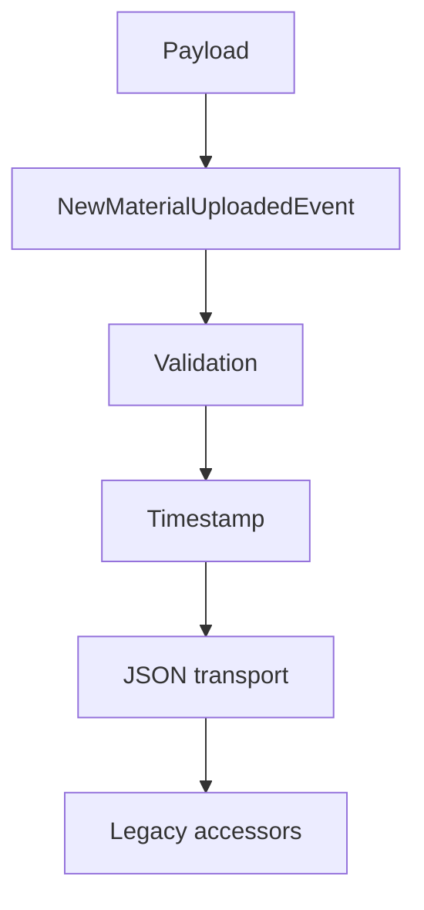

# Messaging Events - Documentacion de fase 1

Esta documentacion cubre solo lo que existe dentro de `messaging/events` al momento de esta fase. No intenta explicar integraciones externas ni adaptar el modulo a consumidores concretos.

## Proposito

Define eventos de dominio serializables, hoy centrados en `MaterialUploadedEvent`.

## Procesos principales

1. Validar campos requeridos del evento y del payload.
2. Estampar `Timestamp` automaticamente al construir el evento.
3. Serializar la estructura resultante a JSON para su transporte.
4. Resolver campos de compatibilidad legacy como `GetS3Key`, `GetMaterialID` y `GetAuthorID`.

## Arquitectura local

- El modulo expone contratos de mensaje, no transporte.
- La validacion vive en el constructor `NewMaterialUploadedEvent`.
- Los helpers legacy reducen friccion con consumidores que aun esperan interfaces antiguas.

## Superficie tecnica relevante

- `MaterialUploadedEvent` y `MaterialUploadedPayload` son los contratos principales actuales.
- `NewMaterialUploadedEvent` concentra la validacion.
- `GetMaterialID`, `GetS3Key` y `GetAuthorID` sirven de compatibilidad.

## Dependencias observadas

- Runtime interno: ninguna dependencia interna del repositorio.
- No depende del modulo RabbitMQ; solo define el payload de negocio.

## Operacion actual

- `make build`, `make test`, `make test-race` y `make check` cubren el modulo.
- La suite actual es unitaria y no necesita infraestructura externa.

## Observaciones actuales

- Hoy el modulo expone un evento de dominio principal; no se observaron otros schemas aun.
- El transporte o delivery queda en otros modulos.
- Tiene README historico y tests unitarios propios, ahora absorbidos por la nueva estructura.

## Limites de esta fase

- La gobernanza de eventos a escala de ecosistema se documentara en la fase 2.
- No documenta aun integraciones con el archivo externo `ecosistema.md`.
- No redefine politicas de release por modulo; eso queda para la fase 3.
