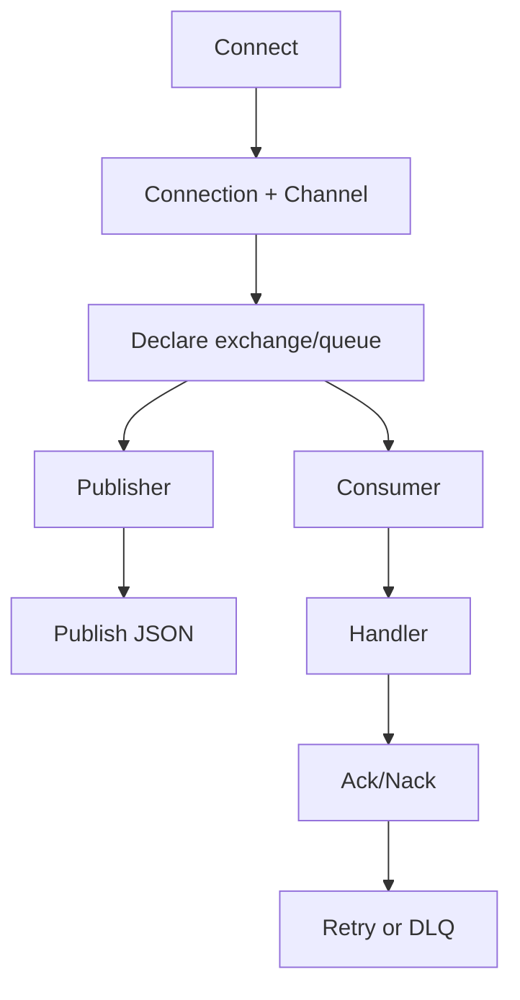

# Messaging RabbitMQ - Documentacion de fase 1

Esta documentacion cubre solo lo que existe dentro de `messaging/rabbit` al momento de esta fase. No intenta explicar integraciones externas ni adaptar el modulo a consumidores concretos.

## Proposito

Runtime RabbitMQ para publicar y consumir mensajes JSON con soporte opcional de DLQ y retries.

## Procesos principales

1. Conectar a RabbitMQ y abrir un canal reutilizable.
2. Declarar exchanges, queues, bindings y QoS/prefetch segun configuracion.
3. Publicar mensajes serializados a JSON con prioridad y contexto.
4. Consumir mensajes, ejecutar handlers y hacer ack o nack segun resultado.
5. Aplicar retries con headers y backoff, o mover mensajes a DLQ cuando se supera el maximo.

## Arquitectura local

- `Connection` encapsula conexion, canal y operaciones topologicas.
- `Publisher` y `Consumer` desacoplan publishing del loop de consumo.
- `DLQConfig` define una politica de reintentos simple sin scheduler externo.

## Superficie tecnica relevante

- `Config`, `ExchangeConfig`, `QueueConfig`, `ConsumerConfig` y `DLQConfig` modelan la topologia y politicas.
- `Connect` crea la conexion base.
- `NewPublisher` y `NewConsumer` exponen publishing y consuming.
- `HandleWithUnmarshal` y `UnmarshalMessage` ayudan en handlers JSON.

## Dependencias observadas

- Runtime interno: ninguna dependencia interna en produccion.
- Tests internos: `testing` para Docker/Testcontainers.
- Runtime externo: `github.com/rabbitmq/amqp091-go`.

## Operacion actual

- `make build`, `make test`, `make test-race` y `make check` cubren el modulo.
- `make test-all` ejecuta integracion con RabbitMQ real usando Docker.

## Observaciones actuales

- El modulo cubre tanto happy path como reintentos y DLQ.
- La salud de la conexion se valida mediante un exchange temporal para evitar race conditions.
- Tiene tests unitarios e integracion bastante amplios.

## Limites de esta fase

- Las topologias concretas por servicio o dominio quedan para la fase 2.
- No documenta aun integraciones con el archivo externo `ecosistema.md`.
- No redefine politicas de release por modulo; eso queda para la fase 3.
