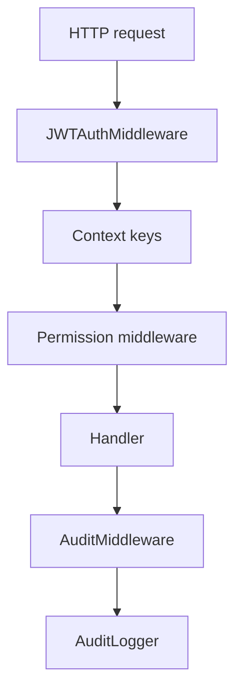

# Middleware Gin - Documentacion de fase 1

Esta documentacion cubre solo lo que existe dentro de `middleware/gin` al momento de esta fase. No intenta explicar integraciones externas ni adaptar el modulo a consumidores concretos.

## Proposito

Middleware HTTP para validar JWT, poblar contexto, verificar permisos y registrar auditoria.

## Procesos principales

1. Validar el header `Authorization: Bearer ...` y el JWT usando `auth.JWTManager`.
2. Poblar el `gin.Context` con `user_id`, `email`, `role` y `jwt_claims`.
3. Aplicar middlewares de permiso simple, any-of o all-of segun permisos del contexto activo.
4. Registrar eventos de auditoria para metodos mutantes y derivar recurso e identificador desde la ruta.
5. Exponer getters y must-getters para que los handlers consuman el contexto tipado.

## Arquitectura local

- Los middlewares se apoyan en los modulos `auth`, `audit` y `common/types/enum`.
- La validacion de claims y la respuesta HTTP viven dentro del middleware, no del handler.
- La auditoria se ejecuta despues de `c.Next()` para capturar status final.

## Superficie tecnica relevante

- `JWTAuthMiddleware` resuelve autenticacion.
- `RequirePermission`, `RequireAnyPermission` y `RequireAllPermissions` resuelven autorizacion.
- `AuditMiddleware` compone eventos de auditoria.
- `GetUserID`, `GetEmail`, `GetRole`, `GetClaims` y sus variantes `Must*` exponen el contexto.

## Dependencias observadas

- Runtime interno: `auth`, `audit`, `common/types/enum`.
- Runtime externo: `github.com/gin-gonic/gin`.

## Operacion actual

- `make build`, `make test`, `make test-race` y `make check` cubren el modulo.
- La validacion actual es unitaria, enfocada en middleware y helpers de contexto.

## Observaciones actuales

- Este modulo asume que los claims validos incluyen `ActiveContext` con permisos.
- El middleware de auditoria ignora requests de solo lectura.
- Tiene tests unitarios sobre auth, permisos, contexto y auditoria.

## Limites de esta fase

- La ubicacion de este middleware dentro de cada servicio HTTP del ecosistema se documentara mas adelante.
- No documenta aun integraciones con el archivo externo `ecosistema.md`.
- No redefine politicas de release por modulo; eso queda para la fase 3.
