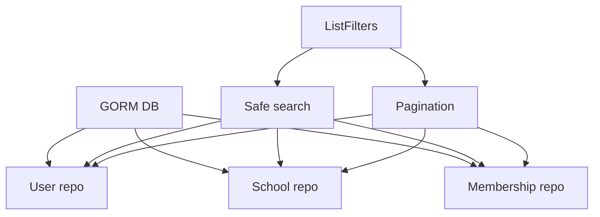

# Repository - Documentacion de fase 1

Esta documentacion cubre solo lo que existe dentro de `repository` al momento de esta fase. No intenta explicar integraciones externas ni adaptar el modulo a consumidores concretos.

## Proposito

Adaptadores GORM para CRUD y listados seguros sobre entidades externas de PostgreSQL.

## Procesos principales

1. Construir queries base por entidad (`User`, `School`, `Membership`) con contexto.
2. Aplicar filtros de actividad segun el tipo de repositorio.
3. Aplicar busqueda segura con `ILIKE` y escaping de patrones via `ListFilters`.
4. Aplicar paginacion y retornar el total antes de materializar la lista.
5. Resolver operaciones CRUD directas sobre entidades del modulo externo de infraestructura.

## Arquitectura local

- El modulo depende de entidades definidas fuera de `edugo-shared`.
- `ListFilters` es la pieza transversal mas reusable y protege contra field names invalidos.
- Cada repositorio concreto envuelve un `*gorm.DB` y mantiene logica de query minima.

## Superficie tecnica relevante

- `ListFilters` expone `ApplySearch`, `ApplyPagination` y `GetOffset`.
- `UserRepository`, `SchoolRepository` y `MembershipRepository` definen contratos CRUD.
- `NewPostgresUserRepository`, `NewPostgresSchoolRepository` y `NewPostgresMembershipRepository` crean adaptadores concretos.

## Dependencias observadas

- Runtime interno: ninguna dependencia interna del repositorio.
- Runtime externo: `gorm.io/gorm`, `github.com/google/uuid` y `github.com/EduGoGroup/edugo-infrastructure/postgres/entities`.

## Operacion actual

- `make build`, `make test` y `make check` existen localmente.
- El modulo no esta hoy en el `Makefile` raiz ni en las matrices de CI/release del repositorio.

## Observaciones actuales

- La dependencia mas fuerte del modulo es hacia entidades externas, no hacia modulos internos de `edugo-shared`.
- Los tests encontrados cubren `ListFilters` y sus reglas de seguridad, no CRUD real sobre base de datos.
- Requerira especial atencion en fase 3 por estar fuera de la validacion raiz.

## Limites de esta fase

- La integracion con el modulo externo `edugo-infrastructure` se analizara en la fase 2.
- No documenta aun integraciones con el archivo externo `ecosistema.md`.
- No redefine politicas de release por modulo; eso queda para la fase 3.
