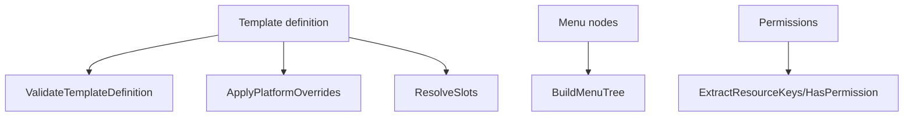

# ScreenConfig - Documentacion de fase 1

Esta documentacion cubre solo lo que existe dentro de `screenconfig` al momento de esta fase. No intenta explicar integraciones externas ni adaptar el modulo a consumidores concretos.

## Proposito

Utilidades para validar templates, resolver slots, aplicar overrides por plataforma y construir arboles de menu.

## Procesos principales

1. Validar patrones, screen types, plataformas y definiciones JSON de templates.
2. Aplicar overrides por plataforma con fallback `ios/android -> mobile`.
3. Resolver placeholders `slot:*` dentro de definiciones JSON.
4. Construir arboles de menu jerarquicos a partir de nodos planos.
5. Extraer claves de recursos y verificar permisos a partir de strings tipo `resource:action`.

## Arquitectura local

- El modulo mezcla DTOs de transporte con funciones puras de transformacion.
- Las funciones trabajan sobre `json.RawMessage` para no acoplarse a structs de UI rigidos.
- La construccion del menu es independiente de almacenamiento y depende solo de `MenuNode`.

## Superficie tecnica relevante

- `BuildMenuTree`, `ApplyPlatformOverrides`, `ResolveSlots` y `ValidateTemplateDefinition` son los puntos mas visibles.
- `ValidatePattern`, `ValidateScreenType`, `ValidatePlatform` y `ResolvePlatformOverrideKey` cubren la capa de validacion y fallback.
- Los DTOs (`ScreenTemplateDTO`, `ScreenInstanceDTO`, `CombinedScreenDTO`, `NavigationConfigDTO`, etc.) modelan payloads compartidos.

## Dependencias observadas

- Runtime interno: sin dependencias internas del repositorio.
- Trabaja con `encoding/json` y tipos propios.

## Operacion actual

- `make build`, `make test`, `make test-race` y `make check` cubren el modulo.
- La suite actual es unitaria y trabaja sobre transformaciones puras.

## Observaciones actuales

- El foco del modulo es declarativo: transforma y valida, pero no persiste.
- El fallback de plataforma esta explicitamente codificado en `PlatformFallback`.
- Tiene tests unitarios sobre menu, permisos, overrides, slots y validacion.

## Limites de esta fase

- La forma en que otros modulos o clientes consumen estos DTOs se cubrira en la fase 2.
- No documenta aun integraciones con el archivo externo `ecosistema.md`.
- No redefine politicas de release por modulo; eso queda para la fase 3.
