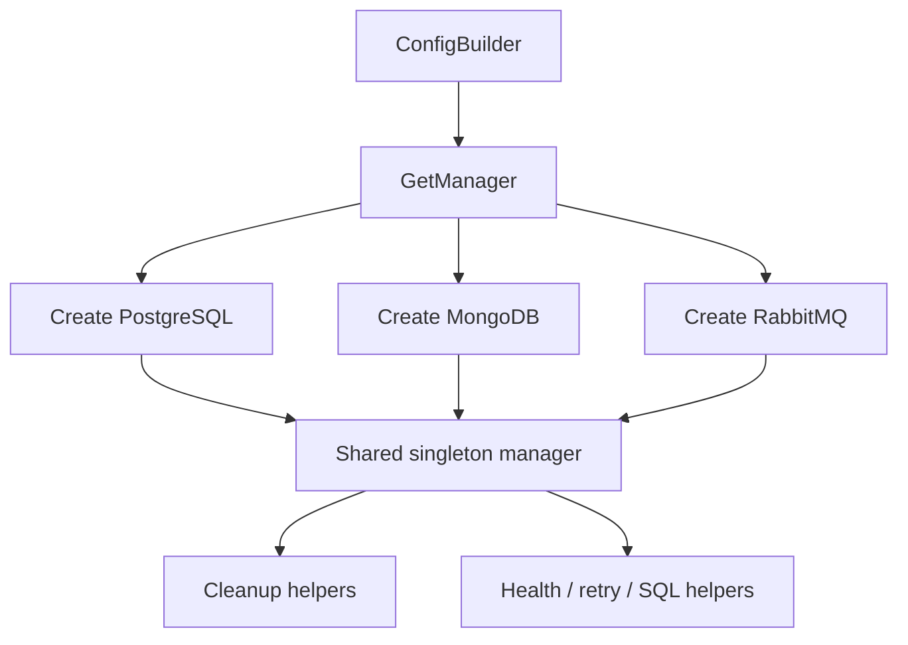

# Testing - Documentacion de fase 1

Esta documentacion cubre solo lo que existe dentro de `testing` al momento de esta fase. No intenta explicar integraciones externas ni adaptar el modulo a consumidores concretos.

## Proposito

Infraestructura de testing basada en Testcontainers para PostgreSQL, MongoDB y RabbitMQ, expuesta principalmente via el package `containers`.

## Procesos principales

1. Construir una configuracion fluida con `ConfigBuilder`.
2. Obtener un `Manager` singleton y crear solo los containers habilitados.
3. Exponer accesos a containers de PostgreSQL, MongoDB y RabbitMQ para integracion.
4. Limpiar estado entre tests con truncado, drop de colecciones o purge de colas.
5. Reutilizar helpers de salud, retries y ejecucion de SQL.

## Arquitectura local

- Aunque el modulo es `testing`, el package relevante para consumidores es `testing/containers`.
- `Manager` centraliza la vida util de containers para abaratar suites largas.
- Cada backend tiene un wrapper propio (`PostgresContainer`, `MongoDBContainer`, `RabbitMQContainer`).

## Superficie tecnica relevante

- `containers.NewConfig()` inicia el builder.
- `containers.GetManager()` devuelve el singleton de containers.
- `Manager` expone getters de backend y helpers de limpieza.
- `ExecSQLFile`, `WaitForHealthy` y `RetryOperation` son utilidades compartidas.

## Dependencias observadas

- Runtime interno: ninguna dependencia interna del repositorio.
- Runtime externo: `github.com/testcontainers/testcontainers-go` y modulos especializados para PostgreSQL, MongoDB y RabbitMQ.

## Operacion actual

- `make build`, `make test`, `make test-race` y `make check` cubren el modulo.
- `make test-all` requiere Docker para levantar containers reales.

## Observaciones actuales

- La documentacion historica del modulo se reemplaza por esta version centrada en procesos y arquitectura.
- El consumo real ocurre sobre el package `containers`, no sobre un package raiz `testing` con la misma densidad de API.
- El modulo tiene tests unitarios e integracion con Docker.

## Limites de esta fase

- La forma en que cada modulo consumidor reutiliza estos containers se abordara en la fase 2.
- No documenta aun integraciones con el archivo externo `ecosistema.md`.
- No redefine politicas de release por modulo; eso queda para la fase 3.
